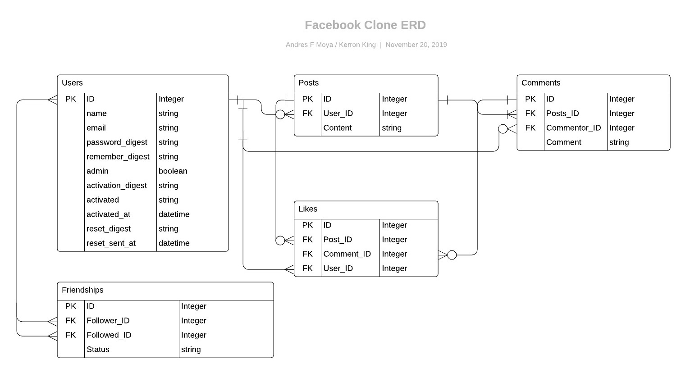

# Social Network
This project consist of building and Test a social network (Faceboko clone), with a large portion of the core Facebook user functionality. Real Facebook accounts Authentication was implemented.

## Live Version

[Social Network](https://frozen-hamlet-01864.herokuapp.com) 

## ERD


## Getting started
  
  To get started with the app, first clone the repo and `cd` into the directory:
  
  ```
  $ git clone https://github.com/AndresFMoya/ROR-Facebook_Clone.git
  $ cd RoR-Facebook_Clone
  ```
  
  Then install the needed gems (while skipping any gems needed only in production):
  
  ```
  $ bundle install --without production
  ```
  
  Next, migrate the database:
  
  ```
  $ rails db:migrate
  ```
  
  Finally, run the test suite to verify that everything is working correctly:
  
  ```
  $ bundle execute rspec
  ```
  
  If the test suite passes, you'll be ready to run the app in a local server:
  
  ```
  $ rails server
  ```

## Contributors
[Kerron King](https://github.com/KerronKing)  
[Andrés F. Moya](https://github.com/AndresFMoya)